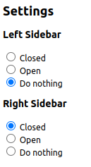

# awsdoc-sidebar-toggler

This Chrome extension automatically closes or opens the sidebars in AWS documents

## Usage

When you access an AWS document page, this extension will automatically close or open the left and right sidebars as specified.

(Note: The extension may make several attempts after the page loads to ensure the settings are applied correctly.)

### Option settings

On the Options page, you can specify the desired action for each sidebar.

(Default: Left Sidebar -> Do nothing, Right Sidebar -> Closed)

## How to Install the Chrome Extension in Developer Mode

1. Download the extension folder to your computer.
2. Open Google Chrome and navigate to `chrome://extensions/`.
3. Enable **Developer mode** by toggling the switch in the top right corner.
4. Click on the **Load unpacked** button.
5. Browse to the downloaded extension folder, select it, and click **Open**.
6. The extension will now be installed in Developer mode.

For more information on using Chrome extensions in Developer mode, you can visit the [Google Chrome Enterprise Help page](https://support.google.com/chrome/a/answer/2714278?hl=en).

## Contributing

Contributions to this project are warmly welcomed! Please feel free to open an issue or submit a pull request.
